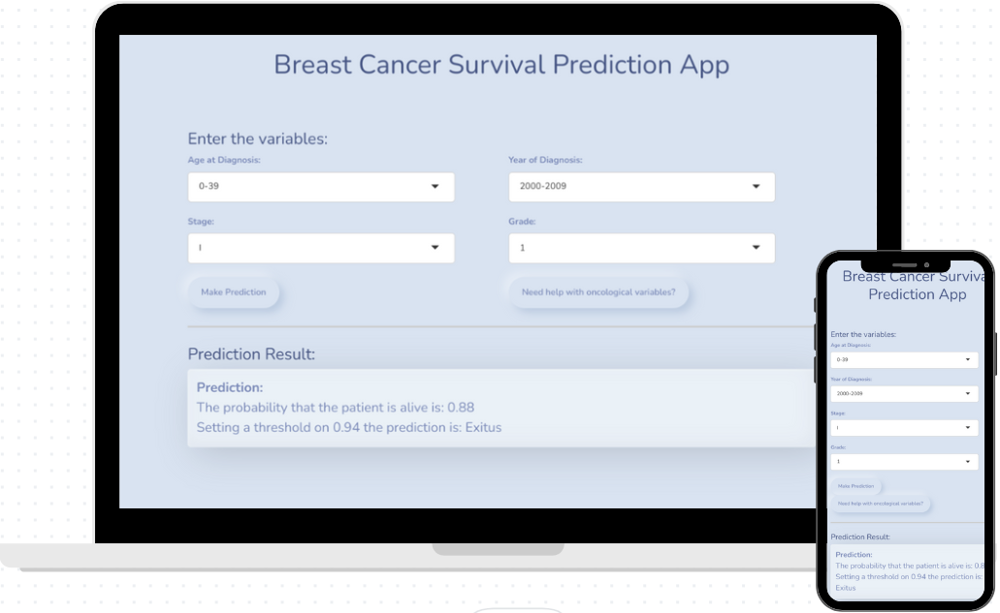

# Breast Cancer Survival Prediction App



## Description

This Shiny application predicts survival in breast cancer patients using a trained neural network model. The prediction is based on the following variables: age at diagnosis, year of diagnosis, cancer stage, and tumor grade.

You can access the application at the following link: [Breast Cancer Survival Prediction App](https://g9bjvd-alex0silva.shinyapps.io/cancerapp/).

## Usage Instructions

1. Open the application in your browser using the provided link.
2. Enter the required variables in the dropdown menus:
    - **Age at Diagnosis:** Select the age at the time of diagnosis.
    - **Year of Diagnosis:** Select the year of diagnosis.
    - **Stage:** Select the cancer stage (I, II, III, IV).
    - **Grade:** Select the histological grade of the tumor (1, 2, 3).
3. Click the **Make Prediction** button to get the prediction.
4. The prediction will be displayed below the action buttons with the survival probability and a classification (Alive or Exitus).

## Features

- **Modern User Interface:** The application uses a modern theme for a better user experience.
- **Data-Driven Prediction:** Utilizes a trained neural network model to predict breast cancer survival.
- **Interactive Help:** Provides information about oncological variables used in the prediction.


## Notes

- This prediction is based on statistical modeling and should not replace personalized medical advice.
- Consult with your healthcare provider for any concerns or questions regarding breast cancer diagnosis or treatment.

## Installation

To run the application locally, follow these steps:

1. Ensure you have R and RStudio installed.
2. Install the necessary R packages:
    ```r
    install.packages(c("shiny", "nnet", "shinyjs"))
    ```
3. Clone this repository:
    ```sh
    git clone https://github.com/yourusername/cancerapp.git
    ```
4. Load the trained model (`modelo_final.RData`) into your working directory.
5. Run the Shiny app:
    ```r
    library(shiny)
    runApp("path/to/your/app")
    ```


